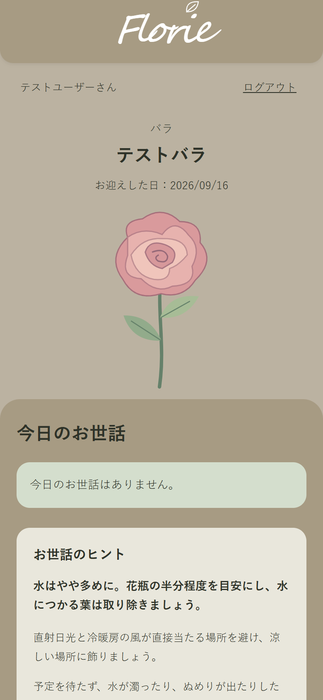
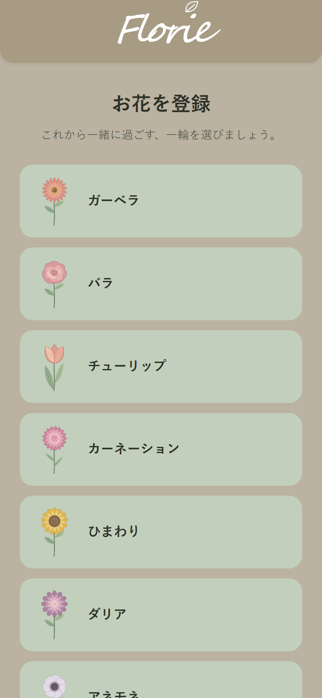
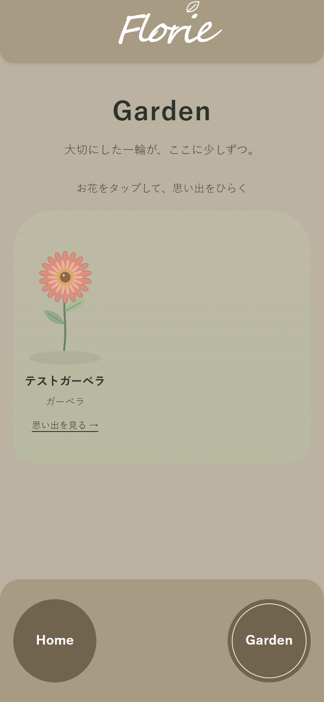
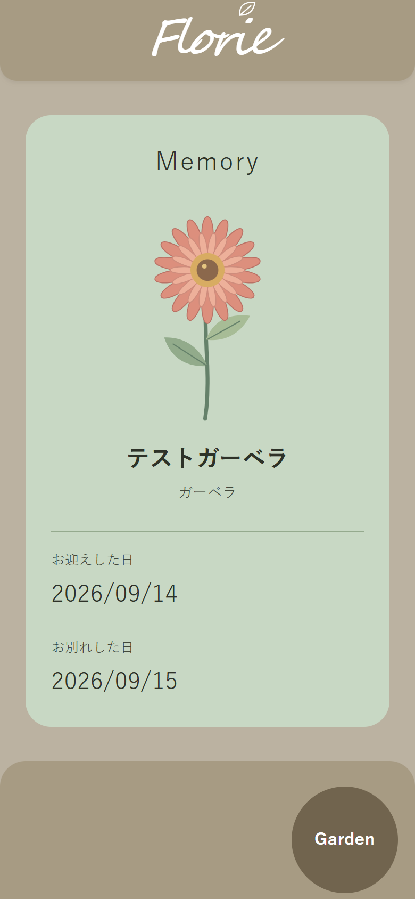

# Florie

一輪と暮らす毎日を、お世話から思い出まで。

## 1. 概要

Florieは、**一輪挿し初心者向けのお花のお世話サポートWebアプリ**です。一度に管理する花を1輪に絞り、「何をすればよいか分からない」「お世話を忘れてしまう」という課題を、花ごとの案内と「今日のお世話」で支援します。

お世話を済ませたら「できた」で記録し、次回の予定を更新します。お別れした花はGardenに残り、Memoryで一緒に過ごした期間を振り返れます。

初期版の主要機能とUIは実装済みです。主要なユーザーフローは実MySQL・実ブラウザで確認しています。

**主要技術：** Java 21 / Spring Boot 4.1.1 / Spring Security / Spring Data JPA / MySQL 8.4 / Thymeleaf / HTML / CSS

## 完成画面

<p align="center">
  
  
</p>

<p align="center">
  <sub>Home ／ 花登録</sub>
</p>

<p align="center">
  
  
</p>

<p align="center">
  <sub>Garden ／ Memory</sub>
</p>

## 2. 開発背景・目的

SE職を目指すにあたり、画面を作るだけではなく、**要件定義 → 基本設計 → 詳細設計 → 実装 → テスト**までの一連の開発工程を自分で経験することを目的として制作しました。

題材には、一輪挿し初心者が感じやすい「何をすればよいか分からない」「お世話を忘れてしまう」という課題を選びました。機能を増やしすぎず、一度に管理する花を1輪に限定することで、初期版として完成させる範囲を明確にしています。

Java・Spring Bootを使ったWebアプリ開発は未経験から開始しました。そのため、単に動作させるだけでなく、Controller・Service・Repositoryなどの役割を分け、後から処理を順番に追って説明できる構成を重視しています。

開発を通して、画面からDBまでの処理の流れ、SQLとEntityの対応、認証・認可、トランザクション、排他制御、正常系・異常系のテストを、実際の設計・実装・動作確認を通じて経験しました。

### AIの活用

開発ではChatGPTやCodexを、設計内容の整理、実装支援、コードレビュー、テスト観点の洗い出しなどに活用しました。

生成された内容をそのまま採用するのではなく、要件・設計との整合性を確認し、コードの内容を確認したうえで、実際の動作確認とテストを行って採否を判断しています。

AIを利用して完成させることだけではなく、最終的に自分で処理の流れや設計理由を説明できる状態にすることを重視しています。

## 3. 主な機能

| 機能 | 内容 |
|---|---|
| ユーザー登録・認証 | ニックネーム・メールアドレス・パスワードで登録。ログイン／ログアウトとセッション管理 |
| 花登録 | 8種類から1種類を選び、花専用のニックネームを設定（必須・1～20文字）。1ユーザーにつきお世話中の花は1輪 |
| お世話予定の自動作成 | 花登録時に、花種類に対応する2件のお世話予定を作成 |
| 花ごとのお世話案内 | 水量・注意事項、各お世話の説明、登録当日の準備、置き場所などの共通案内を表示 |
| 今日のお世話 | 今日が予定日のお世話と、期限を過ぎた未完了のお世話を表示 |
| お世話完了 | 完了履歴を保存し、実際の完了日を基準に次回予定日を更新 |
| Owakare（お別れ） | 確認画面を経て、花をACTIVE（お世話中）からENDED（終了済み）へ変更。終了日も保存 |
| Garden | 自分の終了済みの花を、終了日の新しい順にイラストで一覧表示 |
| Memory | 選択した花の種類・ニックネーム・お迎えした日・お別れした日を表示 |
| 次の一輪を迎える | お別れ後は新しい花を登録可能。以前の花・お世話予定・完了履歴は保持 |

完了履歴はDBへ保存しますが、初期版では履歴一覧画面を設けていません。

## 4. 対応している花

ガーベラ、バラ、チューリップ、カーネーション、ひまわり、ダリア、アネモネ、ラナンキュラスの8種類です。

<p>
  
  
  
  
  
  
  
  
</p>

各種類に、絵柄を揃えたオリジナルSVGイラストを用意しています。画像はプロジェクト内で管理し、外部CDNに依存しません。花登録・Home・Owakare・Garden・Memoryで共通の素材を使います。

## 5. お世話の基本仕様

| お世話 | 周期 | 初回予定日 | 完了後の次回予定日 |
|---|---|---|---|
| 水を替える | 1日 | 花登録日＋1日 | 実際の完了日＋1日 |
| 茎を確認して整える | 3日 | 花登録日＋3日 | 実際の完了日＋3日 |

日付は日本時間（Asia/Tokyo）で扱います。登録当日の準備は案内として表示し、定期タスクにはしません。予定日が今日以前のお世話を表示し、遅れた日数分だけ同じタスクを増やすことはありません。

花ごとの水量や注意事項、共通の置き場所の案内は、完了操作が必要なお世話とは分けて表示します。水の濁り・ぬめり・水切れなどには、予定日を待たずに対応するよう案内しています。

1日・3日という周期は、水道水で飾る場合を標準とした**Florie初期版のUX上の統一仕様**です。すべての花や環境における唯一の最適周期を示すものではありません。延命剤を使う場合は、製品に記載された薄め方・水替え方法を優先します。

採用理由と出典は、[お世話マスタ確定資料](docs/02_Florie_お世話マスタ確定.md)にまとめています。

## 6. 画面・ユーザーフロー

```text
新規登録 → ログイン → Home（花なし）→ New Flower（花登録）
                                      ↓
                              Home（今日のお世話）
                                      ↓
                               「できた」で完了
                                      ↓
                              Homeで次の予定を待つ
                                      ↓
                          Owakare（確認後にお別れ）
                                      ↓
                                Home（花なし）
                                      ↓
                              Garden → Memory
                                      ↓
                         Garden → Home → 新しい花を登録
```

登録後は自動ログインせず、ログイン画面へ戻ります。Owakareのキャンセルは状態を変更せずHomeへ戻ります。GardenはHomeからいつでも開けますが、表示対象は終了済みの花だけです。

## 7. 使用技術

| 分類 | 技術・用途 |
|---|---|
| 言語・実行環境 | Java 21 |
| Webアプリ | Spring Boot 4.1.1、Spring MVC |
| 認証・入力検証 | Spring Security、Bean Validation |
| データアクセス | Spring Data JPA、Hibernate、MySQL Connector/J |
| 画面 | Thymeleaf、HTML、CSS |
| データベース | MySQL 8.4 |
| ビルド | Maven 3.9.16（Maven Wrapperで取得） |
| テスト | JUnit Jupiter、Mockito、MockMvc、Spring Security Test、H2（テスト用途のみ） |
| 開発・管理 | Git、GitHub、VS Code |

フロントエンドフレームワークは導入せず、HTML・CSS・Thymeleafを中心に構成しています。

## 8. アーキテクチャ

```text
ブラウザ → Controller → Service → Repository → Database
              ↓
           Template → HTMLを返す
```

| 要素 | 役割 |
|---|---|
| Controller | リクエストと入力を受け取り、Serviceを呼び出し、表示・遷移先を決める |
| Service | 一輪制限、予定日計算、完了・終了処理などの業務ルールとトランザクションを管理する |
| Repository | 条件を指定したデータの検索・保存を行う |
| Entity | DBのテーブル・関連・日付などをJavaのクラスとして表現する |
| Template | Controllerから渡された値をThymeleafでHTMLに表示する |

主な配置は次のとおりです。

```text
src/main/java/com/florie/
  config/       認証・日本時間のClock設定
  controller/   画面とリクエストの入口
  service/      業務処理
  repository/   DBへのアクセス
  entity/       DBに対応するクラス
  form/         入力項目と検証
src/main/resources/
  templates/    画面と共通フラグメント
  static/       CSS・SVGイラスト
src/test/       自動テスト
sql/            手動適用するスキーマ・初期マスタ
docs/          設計資料・Figma画像
```

設計上の決定は[実装仕様確定資料](docs/01_Florie_実装仕様確定.md)と[お世話マスタ確定資料](docs/02_Florie_お世話マスタ確定.md)、詳細は[設計書一式](docs/01_Florie_設計書一式.docx)に記録しています。これらは決定時点の記録を含み、現在の実装状態は本READMEに整理しています。

## 9. データベース

| テーブル | 役割 |
|---|---|
| users | ユーザーのニックネーム・メールアドレス・パスワードハッシュを保持 |
| flower_types | 花8種類の名前・表示順・画像パス・水量などの案内を保持 |
| care_templates | 花種類ごとのお世話名・周期・説明文を保持（8種類×2件＝16件） |
| flowers | 所有者・花種類・花のニックネーム・開始日・終了日・状態を保持 |
| care_tasks | 登録された花ごとのお世話名・周期・次回予定日を保持 |
| care_records | 対象のお世話予定と実際の完了日を保持 |

ユーザーから花、花からお世話予定、お世話予定から完了履歴へ関連付けています。花種類にはお世話マスタを紐付け、花登録時にその名前・周期を予定へコピーします。

開始日・終了日・予定日・完了日はDATE／LocalDateで扱います。テーブルはSQLで管理し、通常起動時は `spring.jpa.hibernate.ddl-auto=none`、`spring.sql.init.mode=never` として、自動作成・自動投入を行いません。

## 10. 設計・実装で工夫した点

* **一輪制限をDB更新時にも保証**：画面上で登録ボタンを制御するだけでなく、花登録時にユーザー行をロックしてACTIVEの花が存在しないことを確認します。同時に登録処理が実行された場合でも、1ユーザーにつきお世話中の花が1輪というルールを維持できる構成にしました。

* **関連する更新を1トランザクションで処理**：花と2件のお世話予定の作成、お世話完了時の履歴保存と次回予定日の更新など、途中で一部だけが保存されると不整合になる処理をServiceの1トランザクションにまとめています。

* **二重完了を防ぐ処理**：お世話完了時には対象の予定をロックして取得し、更新前に予定日や花の状態を再確認します。二重送信や同時操作が発生しても、同じ予定を重複して完了しにくい構成にしました。

* **認証だけでなく所有者まで確認**：Spring Securityでログイン・ログアウト、セッション、CSRF保護を管理しています。花・お世話予定・Memoryなどを操作・表示するときはURLのIDだけを信用せず、ログインユーザーのデータであることと現在の状態を確認します。

* **実際の暮らしに合わせた予定日計算**：予定日を過ぎても遅れた日数分のタスクを増やさず、完了した日を基準に次回予定日を計算します。ユーザーが数日お世話できなかった場合でも、同じ作業が大量に並ばない仕様にしました。

* **削除せず思い出につなげるデータ設計**：お別れした花は削除せず、状態をACTIVEからENDEDへ変更して終了日を保存します。花・予定・完了履歴を保持することで、同じデータをGardenやMemoryでも利用できます。

* **画面と業務処理を分離**：画面表示はTemplateとCSS、業務ルールはService、DBアクセスはRepositoryに分けています。画面デザインの変更が保存処理へ影響しにくく、処理の流れも追いやすい構成を意識しました。

* **既存データを活かしたイラスト表示**：`illustration_path` に有効なローカルパスがあればそれを使用し、未設定の場合は花名に対応する同梱SVGを表示します。既存のマスタデータを再投入せずに画像表示へ対応できるようにしました。

* **スマートフォン中心のUI**：Figmaで作成したベージュ・緑・茶色と丸みのあるデザインを基に、主要ボタンは52px、入力文字は16pxを基本として実装しました。長いニックネームの折り返し、キーボードフォーカス、文字のコントラスト、セーフエリアなども確認しています。

## 11. テスト

自動テストでは、主に次を確認しています。

| 対象 | 確認内容の例 |
|---|---|
| 認証 | 入力チェック、重複メール、パスワードのハッシュ化、ログイン・ログアウト、セッション |
| 花登録 | 必須・文字数・花選択、一輪制限、予定2件と初回予定日 |
| 今日のお世話 | 当日・期限超過・未来・花なし・該当予定なし |
| お世話完了 | 実際の完了日、次回予定日、二重送信・同時完了、保存失敗時のロールバック |
| お別れ | 確認GETとキャンセルで更新しないこと、ENDED化、終了日、関連データの保持、次の花の登録 |
| Garden・Memory | 自分のENDEDだけの表示、空状態、日付表示、読み取りでDBを変更しないこと |
| アクセス制御 | 未ログイン、CSRFなしのPOST、他ユーザーのID指定、未来の予定・終了済み花への完了操作 |
| イラスト・画面 | 8種類の画像対応、Home・Garden・Memoryの画像、Garden表記、長い名前の表示 |

最終確認時点（2026年9月16日）の自動テストは**88件成功、MavenビルドはBUILD SUCCESS**です。DBを使う機能テストはテスト専用H2で行い、ControllerのテストではMockMvcなどを使用しています。H2での成功はMySQL固有の制約やロック動作の検証を代替するものではありません。

主要機能は別途、実MySQL・実ブラウザでも確認しています。UIはブラウザの幅320／375／390／430pxとPC幅で確認済みです。実機iPhone Safariでの表示・操作確認は、改善候補として残しています。

## 12. セットアップ

### 12.1 必要環境

- JDK 21（`java` と `javac` が利用できること）
- MySQL Server 8.4と `mysql` クライアントコマンド
- Webブラウザ、初回の依存関係取得に必要なインターネット接続

リポジトリを取得し、`pom.xml` があるプロジェクト直下へ移動します。MavenはWrapperが取得するため、別途インストールする必要はありません。以下の手順は、新しく空のDBを準備する場合のものです。既存のFlorie環境ではテーブルやマスタを作り直さないでください。

### 12.2 MySQLのDB・アプリ用ユーザーを準備

MySQLを起動し、プロジェクト直下のターミナルから管理者として接続します。以下の `root` は初期設定用で、アプリからは使用しません。`mysql` にPATHが通っていない場合は、インストール先の実行ファイルを指定してください。

```sh
mysql --default-character-set=utf8mb4 -h localhost -P 3306 -u root -p
```

MySQLの入力画面で次を実行します。`<自分で決めたDBパスワード>` は説明用の置き換え箇所です。実際の値を記入したSQLファイルを保存したり、リポジトリへ追加したりしないでください。

```sql
CREATE DATABASE florie CHARACTER SET utf8mb4;
CREATE USER 'florie_app'@'localhost' IDENTIFIED BY '<自分で決めたDBパスワード>';
GRANT SELECT, INSERT, UPDATE ON florie.* TO 'florie_app'@'localhost';
```

アプリ用ユーザーには現在の機能で必要な読み取り・追加・更新の権限を付与します。次のテーブル作成・構造変更・マスタ投入は、そのまま管理者の接続で行います。

### 12.3 SQLを順番に適用

| 順序 | ファイル | 内容 |
|---|---|---|
| 1 | [01_create_tables.sql](sql/01_create_tables.sql) | 6テーブルを作成 |
| 2 | [02_add_care_guidance.sql](sql/02_add_care_guidance.sql) | 説明用2カラムとお世話マスタの一意制約を追加 |
| 3 | [03_seed_care_masters.sql](sql/03_seed_care_masters.sql) | 花8件・お世話16件を投入 |

MySQLの同じ接続で、1ファイルずつ実行し、各ファイルでエラーがないことを確認してから次へ進みます。

```sql
SOURCE sql/01_create_tables.sql;
SOURCE sql/02_add_care_guidance.sql;
SOURCE sql/03_seed_care_masters.sql;
```

03はトランザクションを開始しますが、**自動でCOMMITしません**。途中も含めエラーがなく、表示された花8件・お世話16件の名前・周期・説明が正しいことを確認してから、同じ接続で確定します。

```sql
COMMIT;
exit
```

03にエラーや内容の不一致があれば、COMMITせず `ROLLBACK;` で取り消します。01・02の構造変更はROLLBACKで戻せないため、失敗した場合はそこで止まり、適用済みの状態を確認してください。01・02は適用済みDBに再実行しません。03も説明・周期を更新するため、通常の起動時に再投入する必要はありません。

初期マスタの画像パスは空文字ですが、アプリが花名に対応する8種類のSVGを表示するため、画像表示用の追加SQLは不要です。

### 12.4 DBパスワードを環境変数へ設定

接続先は `localhost:3306/florie`、ユーザー名は `florie_app` です。パスワードは `FLORIE_DB_PASSWORD` から取得します。`application.properties` や `.env` ファイルへの記入は不要です。

**Windows PowerShell**（入力画面でDBパスワードを指定）：

```powershell
$dbCredential = Get-Credential -UserName 'florie_app' -Message 'FlorieのDBパスワードを入力してください'
$env:FLORIE_DB_PASSWORD = $dbCredential.GetNetworkCredential().Password
Remove-Variable dbCredential
```

**macOS／LinuxのBash**（入力内容は表示されません）：

```bash
read -r -s -p 'Florie DB password: ' FLORIE_DB_PASSWORD
printf '\n'
export FLORIE_DB_PASSWORD
```

どちらも現在のターミナルと、そこから起動するプロセスに適用します。新しくターミナルを開いた場合は再設定してください。

### 12.5 Maven Wrapperで起動

環境変数を設定した同じターミナルで実行します。

**Windows PowerShell：**

```powershell
.\mvnw.cmd spring-boot:run
```

**macOS／Linux：**

```sh
sh ./mvnw spring-boot:run
```

起動後、[http://localhost:8080](http://localhost:8080) を開きます。「新規登録」からユーザーを作成し、ログインして花を登録してください。登録当日の定期タスクは0件が正常で、水替えは翌日、茎の手入れは3日後から表示されます。停止は起動中のターミナルで `Ctrl+C` です。

## 13. テスト実行

プロジェクト直下で実行します。

**Windows PowerShell：**

```powershell
.\mvnw.cmd verify
```

**macOS／Linux：**

```sh
sh ./mvnw verify
```

通常の全件実行には、第12章のMySQL準備と `FLORIE_DB_PASSWORD` の設定が必要です。`FlorieApplicationTests` は通常の設定でアプリの初期化・MySQL接続を確認します。その他のDBを使う機能テストはクラス内でH2へ接続し、一時的なテーブルを作成・破棄するため、実MySQLの登録済みの花を変更しません。

結果はターミナルと `target/surefire-reports/` で確認できます。`verify` の成功だけで、実MySQL上の全操作や実機Safariの表示まで確認したことにはなりません。

## 14. 初期版で対象外とした機能

一輪のお世話から振り返りまでを完成させるため、次は意図的に初期版のスコープ外としています。

- 自由記述の思い出メモ、写真アップロード
- 花の編集・復活、複数輪の同時管理
- お世話履歴の一覧画面、タスクの手動追加・周期編集
- SNS共有
- 季節・気温・延命剤に応じた自動周期変更

## 15. 今後の改善候補

- 実機iPhone Safariで、キーボード表示時を含む操作感を追加確認する。
- 端末ごとのフォント差によるロゴ表示の違いを小さくする。
